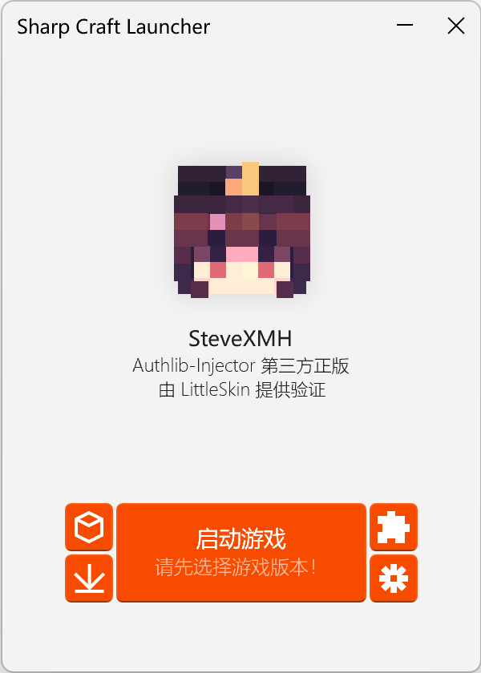
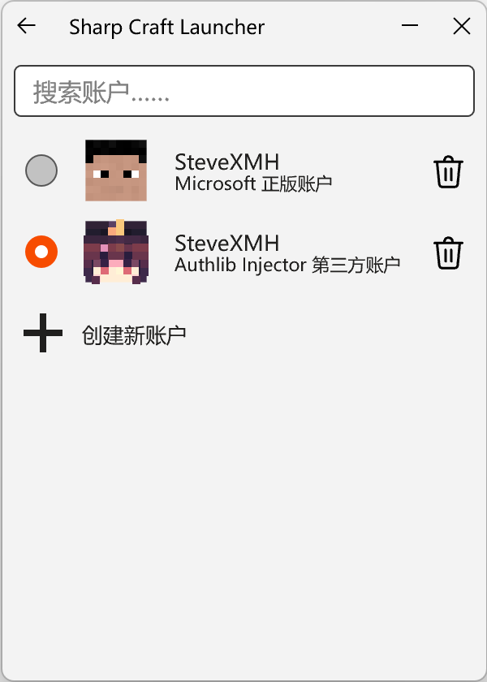
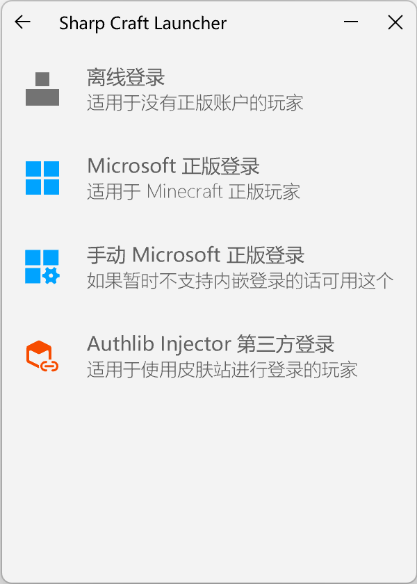
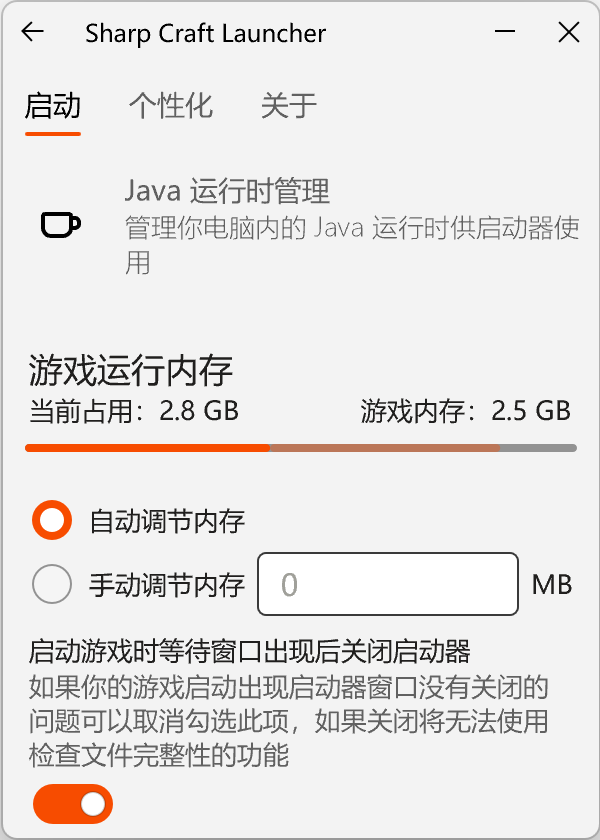
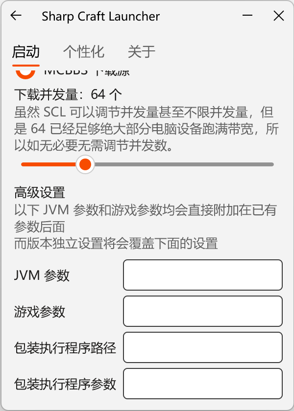
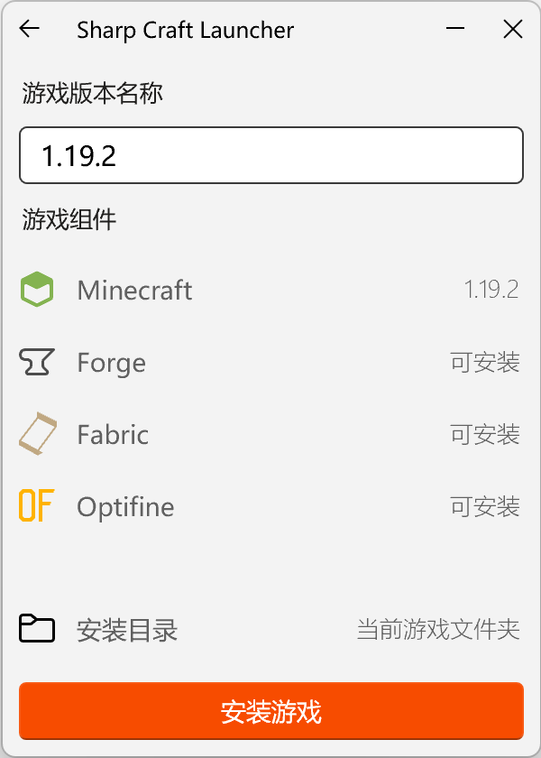
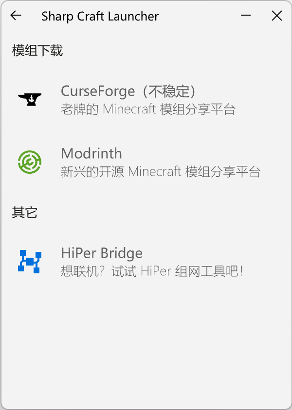
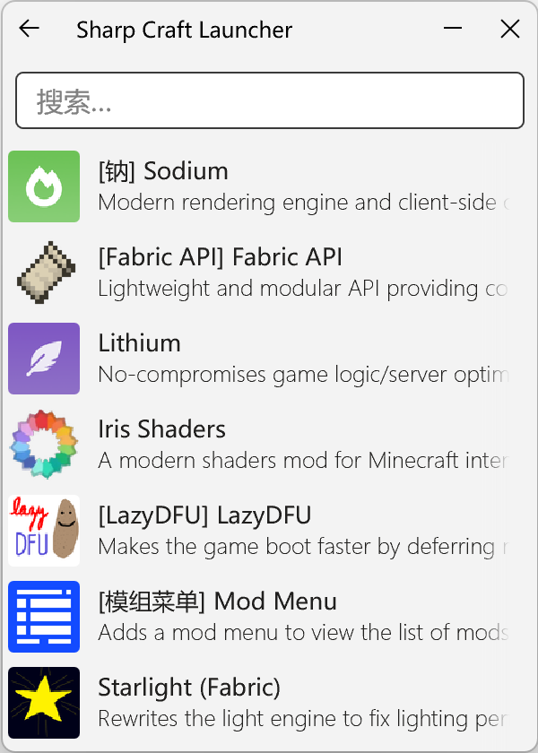
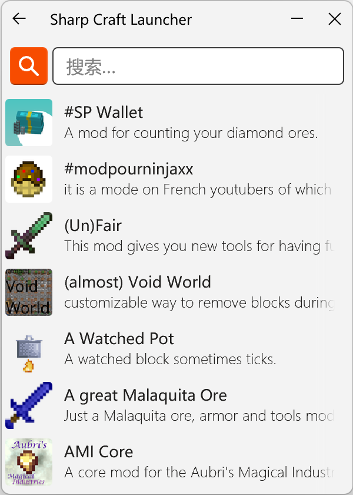
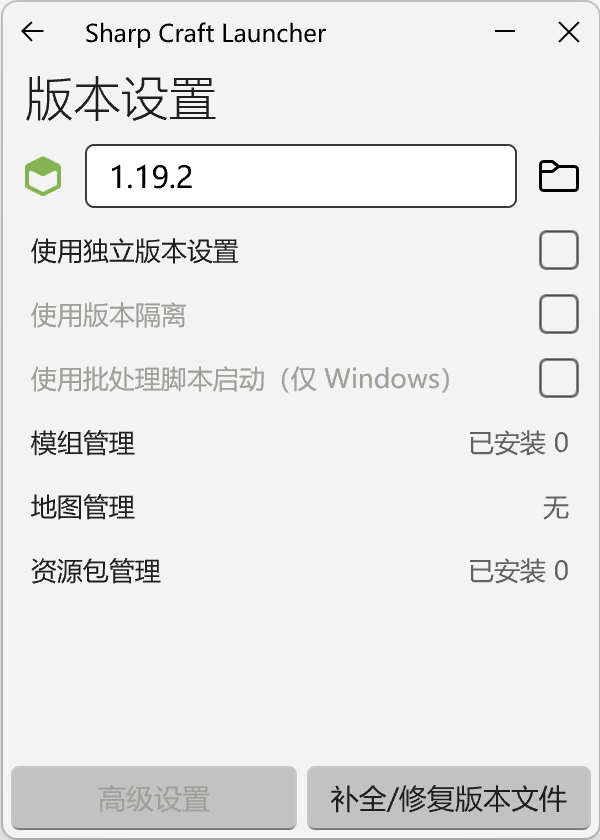

---
  hide:
    - toc
    - navigation
---

<link rel="stylesheet" href="assets/index.css" />

    

  
Sharp Craft Launcher

  
更快，更轻，更锋利的启动器

## 竖向设计，全新体验

独特的竖向流式设计，去掉了很多启动器并无必要的空白（虽然我们清楚这较为美观），空间利用率大为提高。

麻雀虽小，五脏俱全。在狭小的体积装下现有启动器应有的功能，是我们的目标。

启动游戏、下载游戏、模组下载安装、多 Java 支持、版本独立，我们都准备好了。

## 你的启动器，你的风格

Sharp Craft Launcher 提供了大量的个性化配置选项，你可以自由修改主题颜色，黑暗模式，背景图片还有更多东西！

如果不会调节个性化的话，默认预设的亮色和暗色风格也可以满足你！

## Rust 编程语言，领先一步

我们使用了 Rust 作为编写启动器的主要语言，得到了性能和内存的强力优化，同时作为编译型编程语言，没有 VM，没有运行时，更没有动态链接库，冷启动速度得到非常大的提升，同时也减少了用户的安装难度。

## 三大系统，一次满足

Rust 原生级别的跨平台兼容性，不仅原生支持 Windows Linux MacOS 三大主流操作系统平台，甚至使得你几乎不需要任何依赖即可运行 Sharp Craft Launcher。

> 注：除 Linux 需要安装诸如 gtk3 webkit2gtk 等依赖项目，Windows 和 MacOS 均无需安装任何依赖即可运行。
> WinARM 因构建环境问题，需要安装 [ARM64 版本的 Microsoft Visual C++ Redistributable](https://aka.ms/vs/17/release/vc_redist.arm64.exe) 作为依赖方可运行

## 异步不便秘，下载如串稀

得益于 Rust 的零开销异步和强大的多线程操作，只需要一个线程，与异步的百万级并发相结合，就可以用最少的硬件资源，达到最快的下载速度。

同时，我们的下载引擎经过当今 HTTP 传输协议新标准的优化，连接复用、压缩数据等新特性也能大幅提升下载速度。

> 注：在默认设置的情况下（并发数 64），下载原版 1.19 时内存会上涨到 45MB 左右，后会随着下载的完成而逐渐减小。
>
> 而在并发数不限的情况下（预计并发量 3000+），下载原版 1.19 时内存会上涨到 300MB 左右，后会随着下载的完成而逐渐减小。
>
> 尽管异步下载速度非常之快，但是我们认为 64 的并发量已经足够大部分电脑和网络环境使用，如非必要无需调节并发数。

## 流而不阻，畅而不滞

Windows UI 3（前 Fluent Design）的全新圆角流式设计，被大量用于启动器的页面设计。

在设计的同时精简了很多布局，并去掉了大部分启动器长期保留的大侧边留空（或在启动流程内只做到了装饰作用的），采取了竖向流动尺寸的设计，提高了启动器的空间利用率和效率，让你在前往 Minecraft 的路上更加“行云流水”。

## 自身净，安全行，隐私信

不像一些由易语言开发的软件有近半成安全软件会被误报成病毒文件，或者是为了刻意避开病毒审查而去向杀毒软件申诉的启动器，Sharp Craft Launcher 只会使用必要的代码与接口，绝不触碰任何敏感系统接口，更不会刻意收集用户隐私数据。

您在 Sharp Craft Launcher 输入的正版账户和密码，我们不会保存，更不会上传到某处服务器。唯一留在你的电脑里的只有你的用于游戏正版启动的启动令牌和用户名，不仅如此还会进行必要的加密手段，以防止他人未经允许使用你的账户进行游戏。

> 注：现在 VirusTotal 还是会有不定误报问题，似乎社区内也有类似情况，用 Rust 编译的产物最近的构建都会有极少数杀毒软件出现误报问题，请忽略即可。

## 与朋友众乐？HiPer 来帮你！

期望更加稳定的联机工具？尝试一下来自联机框架大佬猫猫研发出来的 HiPer 组网工具吧！

通过 Matrix 链式组网技术，可以将玩家们同时放入一个稳定的网络环境，完全不限制流量和带宽，让你更加快乐地沉浸在朋友之乐中！

我们基于长期编写 SCL 启动器积累下来的组件库，特别制作了一个 HiPer Plus 启动工具 HiPer Bridge 来方便大家使用 HiPer。

同时我们希望这样一个通用功能不应该被嵌入在一个特定游戏用途的启动器中，故单独制作出来，供大家随意使用！

> 注：HiPer 服务需要付费购买组网凭证使用，可以通过 [https://mcer.cn/shop](https://mcer.cn/shop) 购买对应服务
>
> 当然，猫猫的讨论群也有不定期活动可以获得组网凭证，同时也有其他方式免费获取！

## 喜欢吗？来发电支持吧！

随着 SCL 1.0.0 正式版本的发布，我们终于迎来了首个 Rust 编写的 Minecraft 启动器。但是即便如此受限于 Druid 框架的自身限制，有太多功能我们还是无法实现。所以我们同样在计划着新的 SCL 2.0.0 版本的编写，通过使用 FLTK 框架重构我们的 GUI 代码，来带给大家更加出色优秀的 UI！

如果你喜欢我们的启动器，也欢迎来为我们发电，在给予我们鼓励支持的情况下你也可以抢先体验到 SCL1 和 SCL2 的开发构建版本，更快一步知晓我们的进度！

我们相信长时间的打磨和玩家们的发电支持能让 SCL1 / SCL2 变得更加舒适易用。

如果你感兴趣想体验开发中的内测版本，可以通过爱发电搜索 SteveXMH 来找到我们。

> 注：只要五块钱呀！求求了！(っ °Д °;)っ

## 截图展示

## 鸣谢

在此处感谢绝大多数被 SCL 直接或间接引用的各种允许闭源的开发框架！
没有他们的贡献，这个项目就不可能出现了！

经过了作者的精心挑选，SCL 启动器所直接引用的依赖框架均允许商业闭源发放，为了感谢这些框架作者，此处列出了主要使用的框架名称以及仓库链接：

- Druid GUI 框架
- Smol 异步框架
- Surf HTTP 客户端框架
- Serde 序列化/逆序列化框架
- Serde JSON 序列化/逆序列化框架
- Nom 二进制/字符串解析框架
- TOML 解析框架
- Image 图片解析框架
- Futures 异步辅助框架
- Windows 绑定库
- WebView2 嵌入式浏览器框架
- Webkit2GTK-rs 嵌入式浏览器框架
- Chrono 时间框架
- ……还有很多！

如果以上列表中没能列出您开发的框架，请立刻联系我们添加！

最后感谢每一个发电的金主爸爸！还有前来下载使用的大家！非常感谢！

## 正式版本下载

你可以访问我们的主页（Github Pages，部分地区可能无法直接连接）获取到下载链接

<!-- 为了不让标题改变留一个空标题在底下 -->
# 
